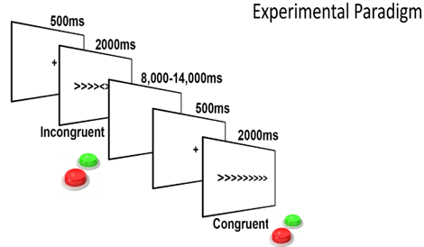

# Exploring-Cognitive-Control-through-fMRI-Analysis: A Comprehensive Data Analysis Report
## Abstract

This README provides a comprehensive analysis of the Flanker Dataset using functional magnetic resonance imaging (fMRI) to investigate the neural basis of cognitive control. The study examines variations in the BOLD signal between Congruent and Incongruent Flanker trials. Various analyses, including quality control, preprocessing, statistical modeling, and post-analysis, were performed using the FSL software. The results offer valuable insights into the neural mechanisms underlying cognitive control and response inhibition.

## Table of Contents

- [Introduction](#introduction)
- [Experimental Design](#experimental-design)
- [Data Collection](#data-collection)
- [Analysis](#analysis)
  - [Quality Control](#quality-control)
  - [Preprocessing](#preprocessing)
  - [First-Level Analysis](#first-level-analysis)
  - [Second-Level Analysis](#second-level-analysis)
  - [Third-Level Analysis](#third-level-analysis)
  - [ROI Analysis](#roi-analysis)
- [Results and Interpretation](#results-and-interpretation)
- [Discussion](#discussion)
- [Conclusion](#conclusion)
- [References](#references)
- [Submission](#submission)
- [Scripts](#scripts)

## Introduction

This study investigates cognitive control processes, particularly attention and response inhibition, using the Flanker Dataset and fMRI. This report details the experimental design, data collection procedures, and a comprehensive analysis pipeline, providing insights into the neural mechanisms of cognitive control.

## Experimental Design

 
Figure 1, Flanker Task Trial

The Flanker task, a well-established paradigm for studying cognitive control, was employed. Participants were presented with Congruent and Incongruent Flanker trials, requiring a button press based on the central arrow's direction.

## Data Collection

Twenty-six adult participants underwent 2 fMRI runs while performing the Flanker task. High-resolution anatomical images and functional scans were acquired.

## Analysis

 
Figure 2, Project Workflow

### Quality Control

Quality control procedures identified motion artifacts in specific subjects, addressing potential confounds in the subsequent analysis.

[QC file](assets/QC.ods)

 
Figure 3, QC Sample

### Preprocessing

Anatomical and functional images underwent preprocessing steps, including brain extraction, temporal filtering, motion correction, smoothing, registration of functional to anatomical, and normalization to the MNI152 template.

 
Figure 4, Brain extraction sample, t = 0.1 "RED" and t = 0.5 "BLUE"

### First-Level Analysis

The first-level analysis included GLM modeling with contrasts for congruent and incongruent conditions. Post-stats analysis identified activated pixels and clusters.

 
Figure 5, Registration of highres to standard

 
Figure 6, Rendered threshold zstat3 run1, The difference between incongruent and congruent.

### Second-Level Analysis

Different algorithms, including Fixed Effect, Flame 1, and Simple OLS, were applied in the second-level analysis to determine the most effective approach, which was "Fixed Effect".

 
Figure 7, Group analysis statistical results.

### Third-Level Analysis

Whole-brain analysis was performed using Flame 1 based on the Fixed Effect algorithm.
#### The Fixed Effects model:
 assumes all variability is within subjects, ignoring between-subject differences. It is useful for combining multiple sessions from the same subject but cannot be generalized to a larger population. 
#### The Mixed Effects: 
Simple OLS model includes both within-subject and between-subject variability but can underestimate variance at the group level, leading to overly optimistic inferences.
#### Mixed Effects: 
FLAME 1 separates within-subject and between-subject variability more accurately, providing reliable group-level effect estimates and generalizability to the population.

#### Mixed Effects:
FLAME 1+2 further refines this approach with an iterative Bayesian technique, delivering the most reliable and precise inferences for complex group-level analyses.

 
Figure 8, The difference between Flame 1 and Flame 1 + 2 in fsleyes.

 
Figure 9, The 3D view of the clusters.

### ROI Analysis

Regions of interest (ROIs) were identified and confirmed using a confirmation test to ensure the significance of the identified clusters.

Using Harvard – oxford cortical structure atlas : is a probabilistic atlas which means that the voxels at the center of the crosshairs in the viewing window is assigned a probability of belonging to a brain structure.

 
Figure 10, The paracingulate gyrus from the atlas.

This ROI is more localized so we have more power to detect the cognitive control effect.
We can apply the ROI for the coordinates (0, 20, 44) on the MNI standard image

 
Figure 11, the output of the mask in fsleyes.

## Results and Interpretation

### Lateral Occipital Cortex, Inferior Division
 
Figure 12, Lateral Occipital Cortex, Inferior Division

- To reduce false positives, Eklund (2016) suggested accepting only P-values < 0.001.
- Lateral Occipital Cortex, Inferior Division: Associated with visual processing, object recognition, and scene perception.
- Flanker Task: Although the task focuses on cognitive control, participants still engage early visual areas while processing visual stimuli.

### Lateral Occipital Cortex, Superior Division
 
Figure 13, Lateral Occipital Cortex, Superior Division

- Lateral Occipital Cortex, Superior Division: Associated with processing visual motion information.
- Flanker Task: Focuses on cognitive control, but participants still process visual motion information while viewing stimuli.

### Precentral Gyrus
 
Figure 14, Precentral Gyrus

- Precentral Gyrus: Associated with motor control and movement initiation.
- Flanker Task: Requires cognitive control. Participants inhibit responses, supported by regions like the dorsolateral prefrontal cortex, which communicate with the precentral gyrus for motor execution, emphasizing its role in response control.
- Acknowledged no direct task link, such as activation of the dorsomedial prefrontal cortex.

## Discussion

The results revealed indirect relationships between confirmed clusters and the Flanker task. The discussion interprets these findings in the context of existing literature and theoretical frameworks.

## Conclusion

Despite indirect relationships observed, the study provides valuable insights into the neural mechanisms underlying cognitive control and response inhibition during the Flanker task.

- During the incongruent condition of the Flanker task, activation in the temporal gyrus might reflect its role in processing and integrating contextual information, including the semantic and spatial relationships between stimuli. Additionally, the temporal gyrus is involved in higher-order perceptual processing, such as detecting changes in sensory input and making fine-grained discriminations between stimuli.

 
Figure 15, Temporal Gyrus.

- During the incongruent condition of the Flanker task, where there is conflict between the target and distractor stimuli, the SPL is expected to show increased activation. This activation likely reflects the role of the SPL in directing spatial attention and coordinating the selection of relevant information while suppressing interference from irrelevant stimuli.

 
Figure 16, Superior Parietal Lobule.

## References

- Kelly, A.M., Uddin, L.Q., Biswal, B.B., Castellanos, F.X., Milham, M.P. (2008). Competition between functional brain networks mediates behavioral variability. Neuroimage, 39(1):527-37
- Soares, J.M., Magalhães, R., Moreira, P.S., Sousa, A., Ganz, E., Sampaio, A., Alves, V., Marques, P., and Sousa, N. (2016). A Hitchhiker’s Guide to Functional Magnetic Resonance Imaging. Front. Neurosci. 10:515. doi: 10.3389/fnins.2016.00515
- AndysBrainBook website (https://andysbrainbook.readthedocs.io/en/latest/)

## Submission

This [Report](Exploring-Cognitive-Control-through-fMRI-Analysis.pdf), authored by Mahmoud Mohamed Ali, was submitted as the final project for the "fMRI Data Analysis" course, under the guidance of Prof. Meena M. Makary and Eng. Mohamed Motair.

## Scripts

The repository includes all [scripts](scripts/) utilized in the analysis. These scripts, adapted from [Andy's Brain Book](https://andysbrainbook.readthedocs.io/en/latest/fMRI_Short_Course/fMRI_Intro.html), proved to be versatile and contributed significantly to achieving similar results.
